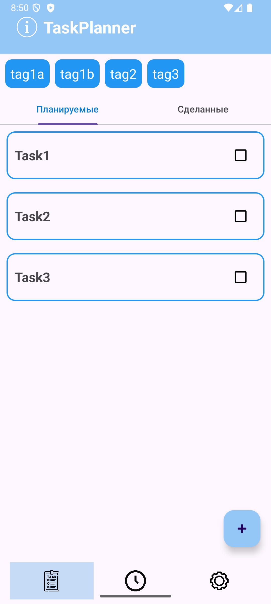
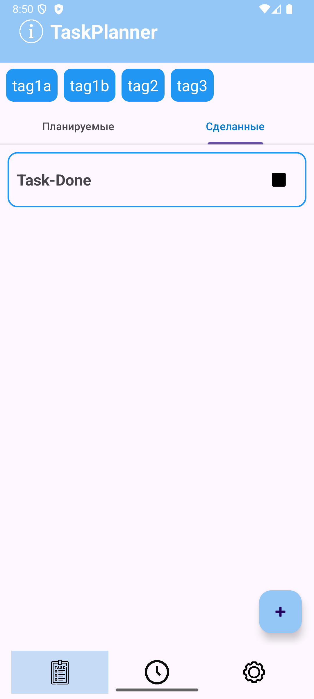
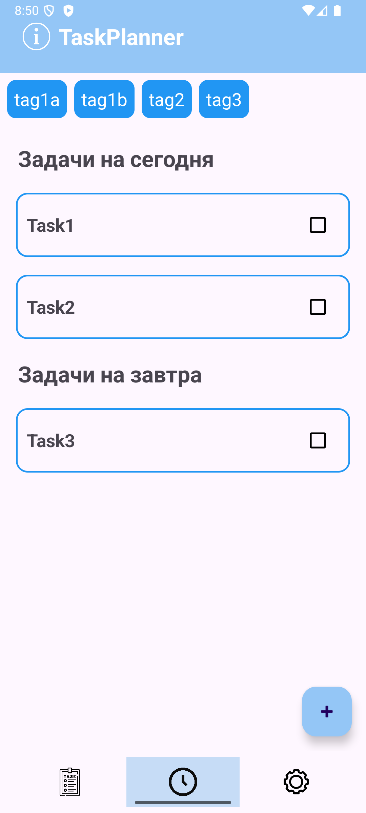
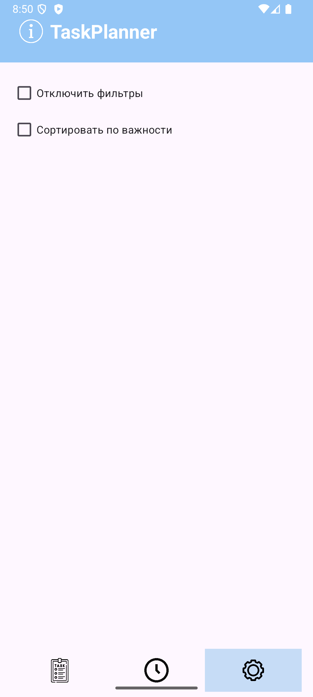
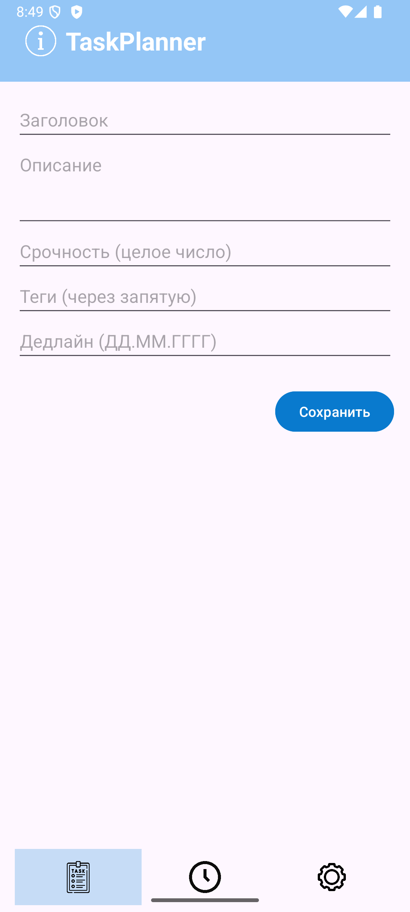

# Планировщик задач

Android-приложение для управления списком задач.
Поддерживаются теги, фильтрация через них, сортировка по срочности, отметки выполнения и хранение задач в базе данных SQLite.
В проекте используется архитектура MVVM.

## Скриншоты:

